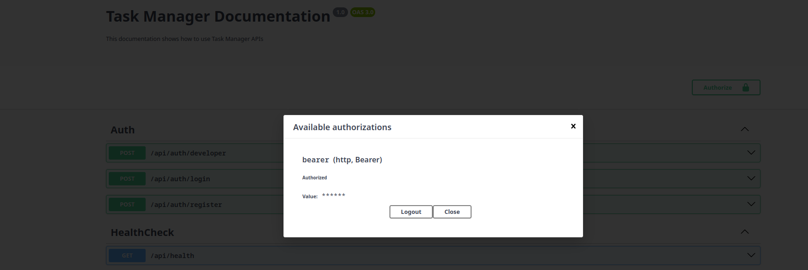
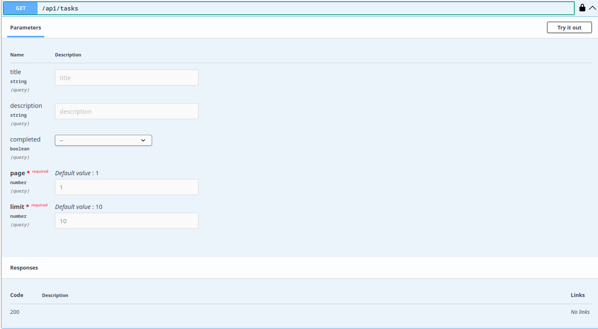
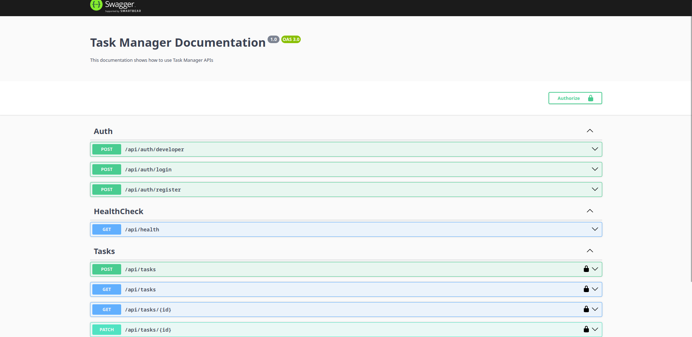
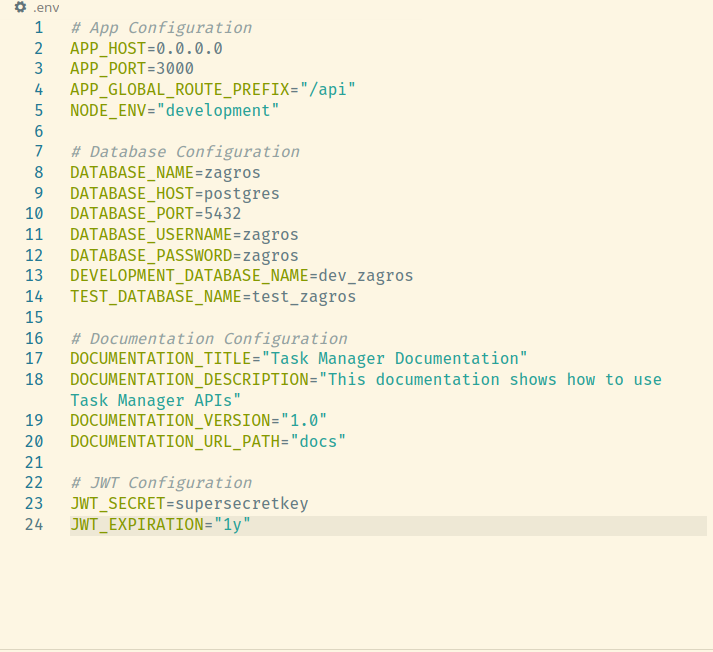
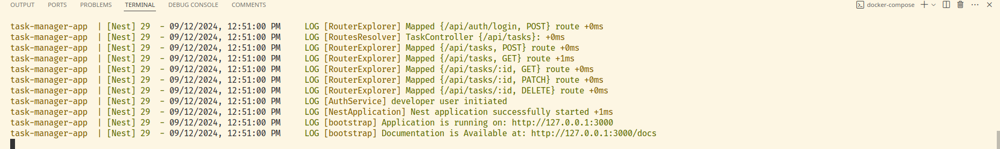

# Task Manager Application

This task manager application is mostly for demonstrating full [unit & e2e] testing and has features like pagination, field filtering, JWT strategy authentication and also swagger documentation.






It has ablity to run in different application pipeline stages like: development, production, test, etc.

Features like developer mode for authentication helps for quick development, you can find in swagger documentation under Auth api's the developer route which gives us authentication token without registration and headaches if we set.




> In order to use developer mode you need to set `NODE_ENV=development` in .env file or process environment.

## Getting started

### Requirements
- You need to have docker and docker compose installed on your machine.

  > If you want to run the project on your local machine without using docker you should have a postgres DB installed or put the accuired DB in `.env` file. 
- Prepare `.env` and put it in the root of project base on `.env.example` example file.
  


### Installation Without Docker
- Go to root of project `task-manager` and run `npm install` or `pnpm install`.
  > You must have `pnpm` installed on your machine if you want to use it.

- Now insert command below to run the server:
  ```sh
  npm run start
  ```

### Running with Docker
At root of project run the below command: 
```sh
docker compse up --build
```
if everything goes well you'll see like below;



### Testing

#### Unit Tests
All important services of application have unit tests.

#### End To End (e2e)  Tests
Every endpoint in the application is tested including the actions below: 
- Authentication
  - Registration
  - Login
  - Developer Mode Login
- Task Management
  - Creating a task
  - Finding a task by it's id
  - List of filtered tasks with pagination
  - Updating a task
  - Deletion of a task
> All actions above are short reviews, but there is much more exception and condition checks in test files.

### Environment variables
Here is example of environment variables with short explanation.

#### App Configuration
- APP_HOST=0.0.0.0
  > its better to keep it to zeros instead of local host in case of inner network usage.
- APP_PORT=3000
- APP_GLOBAL_ROUTE_PREFIX="/api"
- NODE_ENV="development"
  > `NODE_ENV` can be one of these: "development", "production" or  "test"   
  > Based on `NODE_ENV` application sets up the database and developer modes for testing cases.

#### Database Configuration
- DATABASE_NAME=zagros
- DATABASE_HOST=postgres
- DATABASE_PORT=5432
- DATABASE_USERNAME=zagros
- DATABASE_PASSWORD=zagros
- DEVELOPMENT_DATABASE_NAME=dev_zagros
- TEST_DATABASE_NAME=test_zagros
  > Databases has been separated to prevent data loss or conflict of testing and development actions.

#### Documentation Configuration
Using swagger documentation you can register, login , test endpoints of task management and system health checkup.

- DOCUMENTATION_TITLE="Task Manager Documentation"
- DOCUMENTATION_DESCRIPTION="This documentation shows how to use Task Manager APIs"
- DOCUMENTATION_VERSION="1.0"
- DOCUMENTATION_URL_PATH="docs"

#### JWT Configuration
- JWT_SECRET=supersecretkey
- JWT_EXPIRATION="1y"
  > Expiration time can be number value in miliseconds or composite of number and one of these: 'y', 'm', 'd', 's', 'h'.
